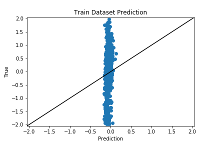
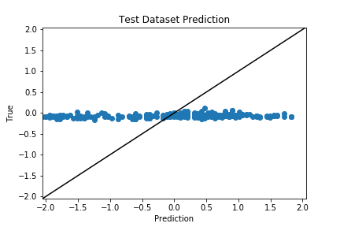

# MRI Data 3D Brain Convolution
---
## Logs
### 09.23
+ Successfully **passed** the 3d brains to model
+ outputs came out but do poorly
+ Current Model
  + layer1
    + Conv3d(1, 8, 5, 3) - BatchNorm3d(8) - ReLU - Dropout(.2) - Maxpool(3, 3)
  + layer2
    + Conv3d(8, 16, 5, 3) - BatchNorm3d(16) - ReLU - Dropout(.2) - Maxpool(3, 3)
  + fc
    + 128 - 64 - 1(regression work)
  + optimizer: Adam, lr=1e-3
  + loss: MSEloss
+ Result: not good   
 
